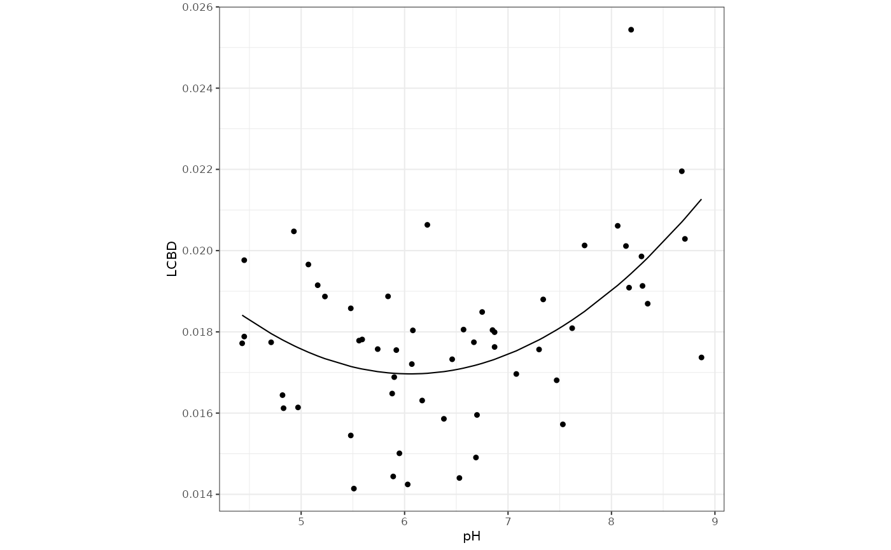
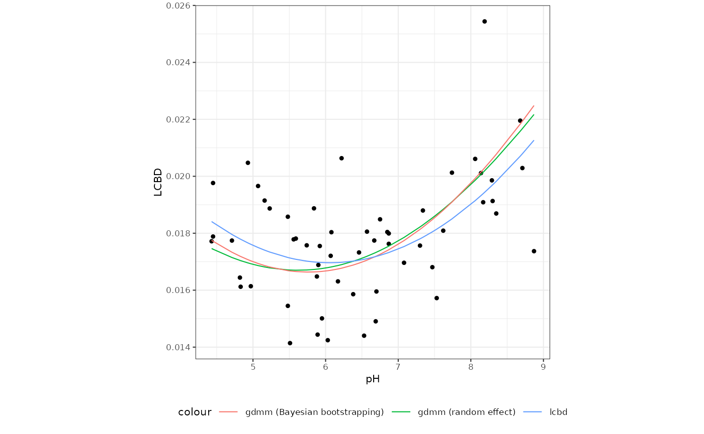
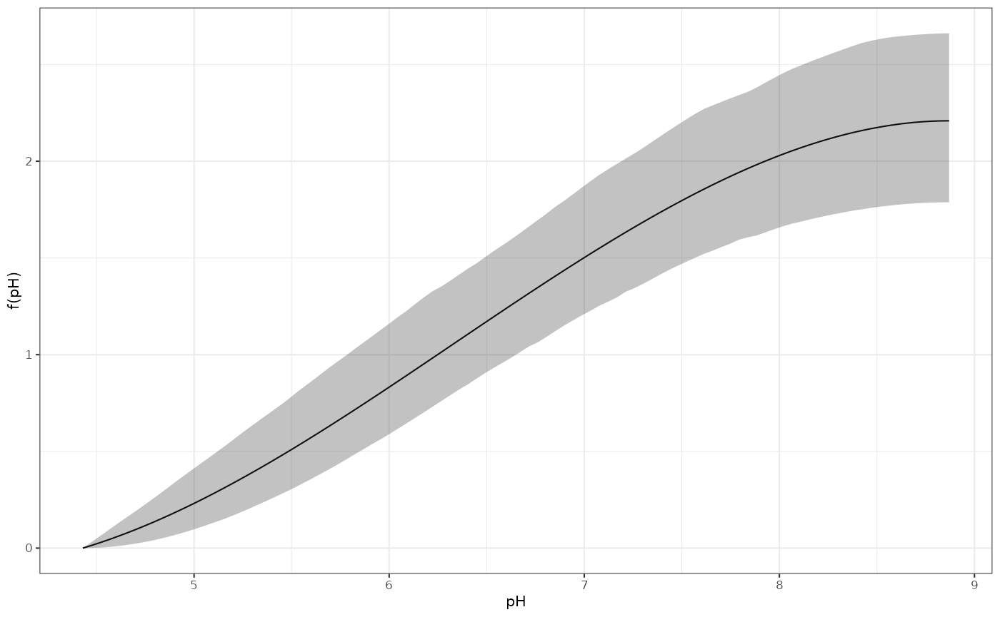
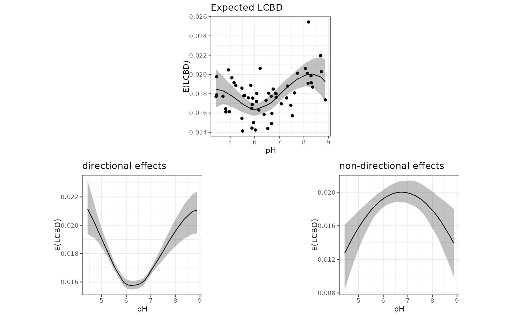

# Modelling community uniqueness with \`gdmmTMB\`

``` r
library(gdmmTMB)
library(ggplot2)
theme_set(theme_bw(base_size = 8))
```

Although the response variable in a Generalised Dissimilarity Model
(GDM) is a pairwise dissimilarity, `gdmmTMB` can also handle effects on
community uniqueness that are mathematically equivalent to those in
models where uniqueness metrics, such as the Local Contribution to Beta
Diversity (LCBD), are the response.

This vignette showcases the usage of `gdmmTMB` to model community
uniqueness using the dataset `microbialdata` available as part of the
`gllvm` R package. The dataset contains the matrices `Y`, which contains
abundances of over 900 species found across 56 microbial communities,
and `Xenv`, which consists of multiple environmental variables measured
at each site

``` r
Xenv <- gllvm::microbialdata$Xenv
Y <- gllvm::microbialdata$Y
```

For the purpose of this example, we focus on `pH` as the main driver of
community variability.

## Modelling linear effects on community uniqueness

Community uniqueness is often modelled as the Local Contribution to Beta
Diversity (Legendre and De Cáceres 2013). A common approach is to (1)
compute LCBD scores from a dissimilarity matrix and (2) model LCBD
scores as independent observations.

The code below computes LCBD scores using the package `adespatial` (Dray
et al. 2018), and regresses them against pH and the quadratic pH term.

``` r

LCBD <- adespatial::LCBD.comp(vegan::vegdist(Y))
Xenv$LCBD <- LCBD$LCBD

m_lcbd <- lm(LCBD~poly(pH,2), data = Xenv)
Xenv$pred_lcbd <- predict(m_lcbd)

ggplot(Xenv , aes(x = pH, y = LCBD)) + 
  geom_point() + 
  geom_line(aes(y = pred_lcbd)) + 
  theme(aspect.ratio = 1)
```



In brief, effects on LCBD denote increasing or decreasing expected
dissimilarity of each community to all other communities. The U-shaped
relationship therefore indicates that communities at the extremes of the
pH gradient are more dissimilar on average to all other communities, and
therefore more unique.

We can obtain the exact same relationship by modelling pairwise
dissimilarities directly, by introducing site-level effects (see
Hernández-Carrasco et al. (2025) for details). This can be done in
`gdmmTMB` via the `uniq_formula` argument:

``` r
# fit model
m_gdmm <-
  gdmm(Y = Y,
       X = Xenv,
       uniq_formula = ~ poly(pH, 2))
#> Warning: the 'nobars' function has moved to the reformulas package. Please update your imports, or ask an upstream package maintainter to do so.
#> This warning is displayed once per session.

# generate predictions
Xenv$pred_gdmm <- predict(m_gdmm, component = 'uniqueness', scale_uniq = TRUE, CI = F)

# Plot relationship
ggplot(Xenv , aes(x = pH, y = LCBD)) + 
  geom_point() + 
  geom_line(aes(y = pred_gdmm, col = 'gdmm'), linewidth = 2, alpha = 0.7) + 
  geom_line(aes(y = pred_lcbd, col = 'lcbd')) + 
  theme(aspect.ratio = 1,
        legend.position = 'bottom')
```


Both models produce the exact same U-shaped relationship between `pH`
and `LCBD`. However, modelling effects on uniqueness with pairwise
dissimilarities allows accounting for the distribution of such
dissimilarities with a more appropriate error distribution link
function. For instance, a binomial error distribution can be specified
via the `family` argument. We can also account for the non-independence
of pairwise dissimilarities with a site-level random effect
(`uniq_formula = ~ ... + (1|site)`), or with Bayesian bootstrapping
(`bboot = TRUE`):

``` r
Xenv$site <- as.factor(1:nrow(Xenv))

# site-level random effect
m_gdmm2 <- gdmm(
  Y = Y,
  X = Xenv,
  uniq_formula = ~ poly(pH, 2) + (1 | site),
  family = 'binomial')

# Bayesian bootstrapping
m_gdmm3 <- gdmm(
  Y = Y,
  X = Xenv,
  uniq_formula = ~ poly(pH, 2),
  family = 'binomial',
  bboot = TRUE)
```



## Accounting for directional community changes

The U-shaped relationship between LCBD and pH above indicates that sites
with low and high pH host relatively more unique species. However, a
representation of the variability in community composition reveals a
strong directional change in community composition along the pH
gradient.


Sites at either end of the pH gradient are therefore further from the
centroid (i.e., they present a higher average dissimilarity to all other
sites), which could underpin the U-shaped relationship between LCBD and
pH. We refer to the contribution of directional changes in community
composition to the observed beta diversity patterns as ‘directional
effects’. Directional effects can be accounted for by making the
expected dissimilarity between sites a function of their environmental
distance (Mokany et al. 2022). In `gdmmTMB`, these directional effects
are introduced via the `diss_formula` argument:

``` r
m_gdmm3 <- gdmm(
  Y = Y,
  X = Xenv,
  uniq_formula = ~ poly(pH, 2),
  diss_formula = ~ isp(pH),
  family = 'binomial',
  bboot = TRUE,
  mono = TRUE)
```

The `diss_gradient` function can be used to visualise dissimilarity
gradients.

``` r
diss_grad <- diss_gradient(m_gdmm3)

ggplot(do.call(rbind, diss_grad), aes(x = x, y = f_x))  +
  geom_line() +
  geom_ribbon(aes(ymin = `CI 2.5%`, ymax = `CI 97.5%`), alpha = 0.3) + 
  xlab('pH') +
  ylab('f(pH)')
```



We can also use the `predict` method to visualise the new expected
relationship between pH and LCBD, and the contributions of each model
component (directional and non-directional effects):

``` r
newdata_mean = data.frame(pH = rep(mean(Xenv$pH), nrow(Xenv)))

predict_tot <- data.frame(
  predict(m_gdmm3, new_X = Xenv, new_W = Xenv, component = 'uniqueness'), 
  pH = Xenv$pH,
  LCBD = Xenv$LCBD)

predict_dir <- data.frame(
  predict(m_gdmm3, new_X = Xenv, new_W = newdata_mean, component = 'uniqueness'), 
  pH = Xenv$pH,
  LCBD = Xenv$LCBD)

predict_nondir <- data.frame(
  predict(m_gdmm3, new_X = newdata_mean, new_W = Xenv, component = 'uniqueness'), 
  pH = Xenv$pH,
  LCBD = Xenv$LCBD)
```



## References

Dray, Stéphane, Guillaume Blanchet, Daniel Borcard, Guillaume Guenard,
Thibaut Jombart, Guillaume Larocque, Pierre Legendre, Naima Madi, Helene
H Wagner, and Maintainer Stéphane Dray. 2018. “Package ‘Adespatial’.” *R
Package* 2018: 3–8.

Hernández-Carrasco, Daniel, Anthony J Gillis, Hao Ran Lai, Tadeu
Siqueira, and Jonathan D Tonkin. 2025. “Accounting for the Influence of
Dissimilarity Gradients on Community Uniqueness.” *bioRxiv*, 2025–09.

Legendre, Pierre, and Miquel De Cáceres. 2013. “Beta Diversity as the
Variance of Community Data: Dissimilarity Coefficients and
Partitioning.” *Ecology Letters* 16 (8): 951–63.

Mokany, Karel, Chris Ware, Skipton NC Woolley, Simon Ferrier, and
Matthew C Fitzpatrick. 2022. “A Working Guide to Harnessing Generalized
Dissimilarity Modelling for Biodiversity Analysis and Conservation
Assessment.” *Global Ecology and Biogeography* 31 (4): 802–21.
