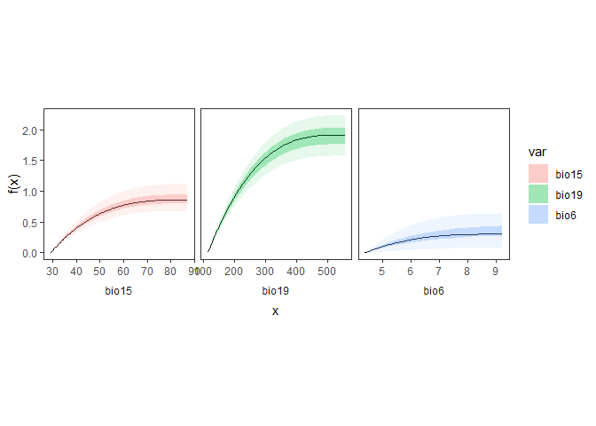

# gdmmTMB

The package `gdmmTMB` provides functions for fitting and interrogating
Generalised Dissimilarity Mixed Models (GDMM) using maximum likelihood
estimation, Laplace approximation and (optionally) Bayesian
Bootstrapping.

# Installation

The package can be installed from GitHub using
`devtools::install_github`:

``` r
devtools::install_github('dhercar/gdmmTMB')
```

# Usage example

The package `gdmmTMB` was designed primarily for the analysis of
ecological datasets where a set of environmental variables is used to
explain variability in species composition.

We start with two matrices:

- `sp`: A community matrix (site x species)
- `env`: A matrix of environmental covariates.

For this example, we use two datasets available as part of the `gdm`
package.

``` r
library(tidyverse)
library(gdmmTMB)

sp <- gdm::southwest %>% select(site, species) %>% 
  group_by(site, species) %>%
  summarise(n = 1) %>%
  pivot_wider(id_cols = site, names_from = species,values_from = n, values_fill = 0) %>%
  arrange(site)

env <- gdm::southwest %>% select(-c(species)) %>%
  distinct() %>% arrange(site)
```

We use `bio6`, `bio15`, and `bio19` as explanatory variables. Monotonic
I-splines for dissimilarity gradients (`diss_formula`) are specified via
`isp(x)` and `mono = TRUE`. The resulting non-linear transformations
reflect the degree of directional community change along each
environmental gradient.

``` r
m <- gdmm(Y = sp[,-1],
          X = env,
          diss_formula = ~ isp(bio6) + isp(bio15) + isp(bio19),
          family = 'binomial',
          method = 'jaccard',
          n_boot = 100, # should be at least 1000
          bboot = TRUE,
          mono = TRUE)
```

``` R
## Running bayesian bootstrapping on 14 cores ...done
```

We specify a `binomial` error family to model Jaccard dissimilarities,

$$y_{ij} = \frac{b_{i} + b_{j}}{a_{ij} + b_{i} + b_{j}},$$

where the dissimilarity between observations $i$ and $j$ depends on the
number of unshared ($b_{i},b_{j}$) and shared ($a_{ij}$) species.

By specifying a binomial distribution, the Jaccard dissimilarity index
is modelled as the probability $\pi$ that a randomly chosen species from
the combined species pool ($2a_{ij} + b_{i} + b_{j}$) is not shared
between observations $i$ and $j$.

### Model summary

The `summary` method in `gdmmTMB` provides general information about the
model, including estimated coefficients, credible or confidence
intervals, and common metrics used for model selection such as AIC and
BIC.

``` r
summary(m)
```

``` R
## -------------------------------------------------------------------------------- 
##                                  BBGDMM SUMMARY 
## -------------------------------------------------------------------------------- 
## 
## call:
## 
##  gdmm(Y = sp[, -1], X = env, diss_formula = ~isp(bio6) + isp(bio15) +     isp(bio19), mono = TRUE, family = "binomial", method = "jaccard",     bboot = TRUE, n_boot = 100)
## 
## --------------------------------- Coeff. Table --------------------------------- 
## 
##                    Estimate  Std.Err.      2.5%       50%     97.5% pseudo-Z
## diss: isp(bio6)1  3.169e-01 1.453e-01 3.586e-02 3.036e-01 6.294e-01   2.1807
## diss: isp(bio6)2  1.353e-02 3.924e-02 1.017e-08 1.448e-08 1.475e-01   0.3448
## diss: isp(bio6)3  1.274e-02 4.265e-02 1.000e-08 1.055e-08 1.547e-01   0.2987
## diss: isp(bio15)1 8.693e-01 1.232e-01 6.749e-01 8.602e-01 1.111e+00   7.0576
## diss: isp(bio15)2 1.064e-08 1.627e-09 1.000e-08 1.003e-08 1.398e-08   6.5362
## diss: isp(bio15)3 1.006e-08 1.904e-10 1.000e-08 1.000e-08 1.038e-08  52.8295
## diss: isp(bio19)1 1.897e+00 1.808e-01 1.571e+00 1.913e+00 2.224e+00  10.4934
## diss: isp(bio19)2 1.008e-08 1.870e-10 1.000e-08 1.000e-08 1.071e-08  53.9203
## diss: isp(bio19)3 1.004e-08 1.510e-10 1.000e-08 1.000e-08 1.034e-08  66.4852
## (Intercept)       8.668e-01 7.342e-02 7.332e-01 8.637e-01 9.932e-01  11.8061
##                   pseudo-Pval    
## diss: isp(bio6)1       < 0.01 ***
## diss: isp(bio6)2       < 0.01 ***
## diss: isp(bio6)3       < 0.01 ***
## diss: isp(bio15)1      < 0.01 ***
## diss: isp(bio15)2      < 0.01 ***
## diss: isp(bio15)3      < 0.01 ***
## diss: isp(bio19)1      < 0.01 ***
## diss: isp(bio19)2      < 0.01 ***
## diss: isp(bio19)3      < 0.01 ***
## (Intercept)            < 0.01 ***

## 
## CAUTION: P-values for dissimilarity components (diss) should not be used for hypothesis testing when "mono = TRUE"

## ---
## signif. codes: '***' <0.001 '**' <0.01 '*' <0.05 '.' <0.1 
## ---
## 
## Marginal log-likelihood (average):  -27784.1 
## AIC:  55588.2 , AICc:  55588.26 , BIC:  55652.03 
## 
## --------------------------------------------------------------------------------
```

### Plot dissimilarity gradients

Predictors in ‘diss_formula’ are treated as environmental distances, and
their contribution to the expected dissimilarity depends on the distance
between samples after (optionally) transformations are applied. For
instance, `isp(bio6)` with `mono = TRUE` defines a non-linear, monotonic
change in community composition that generates increasing
dissimilarities with increasing distance along the gradient
(dissimilarity gradient).The shape of the resulting function can be
informative of the degree of directional community change that each
environmental variable is responsible for.

The function `diss_gradient` provides a list of dissimilarity gradients
and their confidence or credible intervals, which can be easily combined
and plotted:

``` r
f_x <- diss_gradient(m, CI_quant = c(0.5, 0.95))
```

Note that the argument `CI_quant` specifies the coverage of the
confidence or credible interval, not the quantiles themselves (e.g.,
0.95 implies quantiles of 0.025 and 0.975). We have therefore specified
50% and 95% credible credible intervals.

``` r
library(ggplot2)

do.call(rbind, f_x) %>% ggplot(aes(fill = var)) +
  theme_bw() +
  geom_line(aes(x = x, y = f_x)) +
  geom_ribbon(aes(x = x, ymax = `CI 2.5%`, ymin = `CI 97.5%`), alpha = 0.1) +
  geom_ribbon(aes(x = x, ymax = `CI 25%`, ymin = `CI 75%`), alpha = 0.3) +
  facet_wrap(~var, scales = 'free_x', strip.position = "bottom") +
  ylab('f(x)') +
  theme(strip.placement = 'outside', 
        panel.grid = element_blank(),
        strip.background = element_blank(),
        aspect.ratio = 1)
```



The plot shows the relationship between each variable ($x$) and the same
variable after applying the monotonic, non-linear transformation
($f(x)$). Steeper increases in $f(X)$ correspond to fast community
change.
